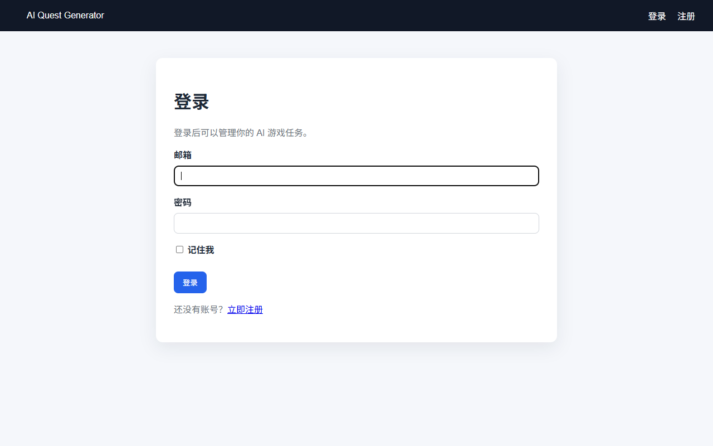
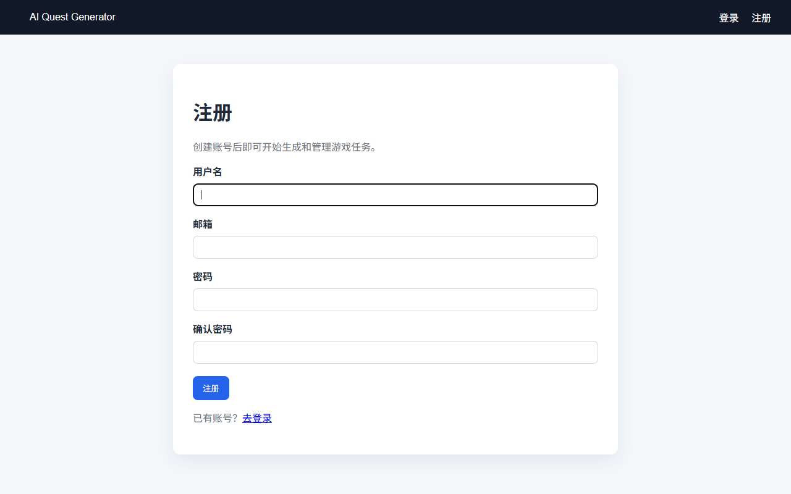
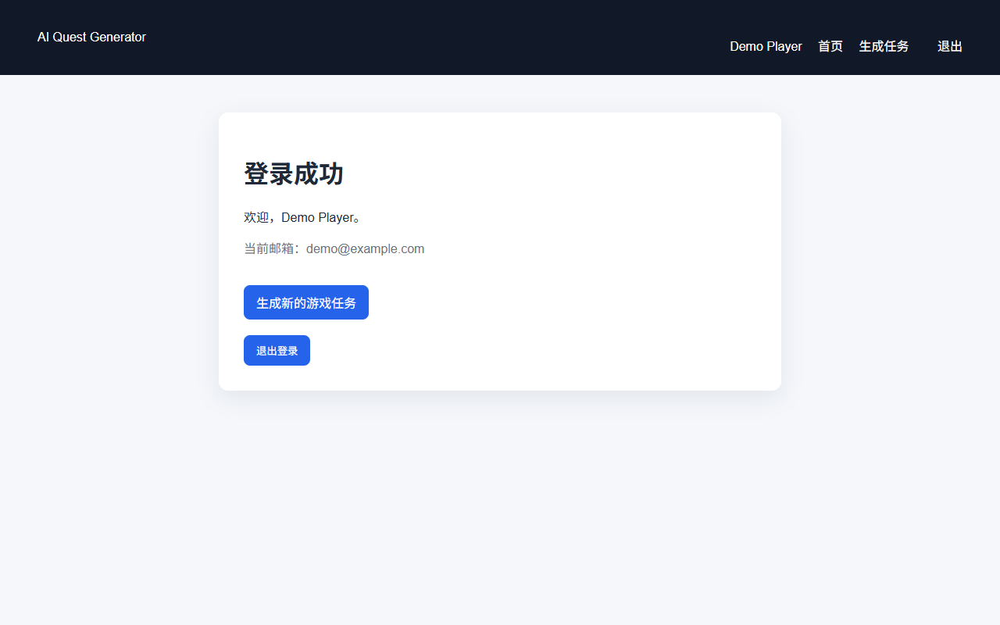
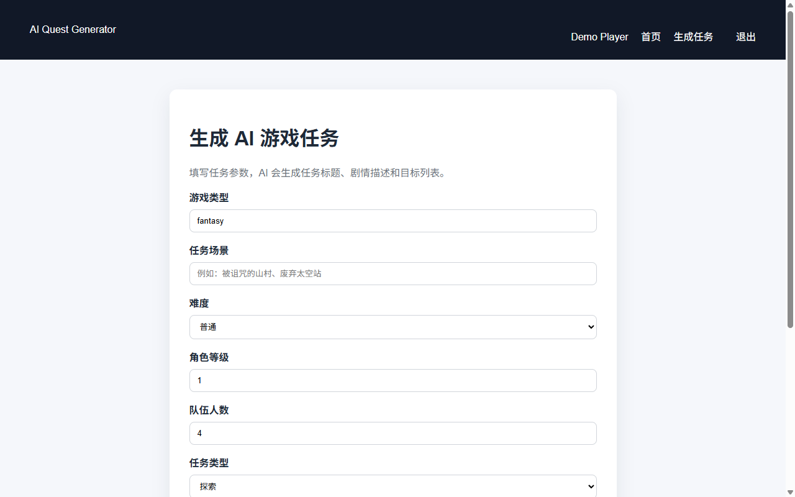
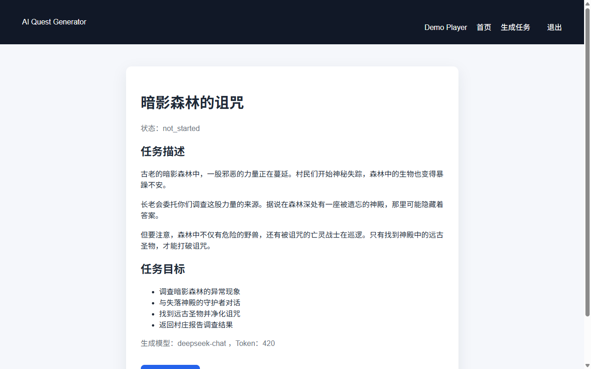

# AI Quest Generator

一个基于 Laravel + DeepSeek API 的 AI 游戏任务生成平台，帮助游戏开发者快速生成任务、NPC 对话和游戏剧情，提高游戏内容制作效率。

## 界面预览

### 登录 / 注册



### 仪表盘


### AI 任务生成



## 功能

- [x] AI 生成游戏任务
- [x] 用户登录 / 注册
- [ ] AI 生成 NPC 对话
- [ ] AI 生成游戏剧情
- [ ] 玩家任务管理
- [ ] 历史记录保存
- [ ] 后台管理

## 技术栈

- Laravel 8
- PHP 7.3+
- MySQL
- Bootstrap (Blade)
- DeepSeek API (兼容 OpenAI)

## 本地开发

```bash
composer install
cp .env.example .env
php artisan key:generate
php artisan migrate
php artisan serve
```

访问：`http://127.0.0.1:8000`

## 环境变量

在 `.env` 中配置：

```env
OPENAI_API_KEY=your_api_key
OPENAI_MODEL=deepseek-chat
OPENAI_BASE_URI=https://api.deepseek.com/v1/
OPENAI_TIMEOUT=60
DB_DATABASE=ai_quest_generator
DB_USERNAME=root
DB_PASSWORD=
```

## 作者

Wang Chuanzhou

## License

MIT
